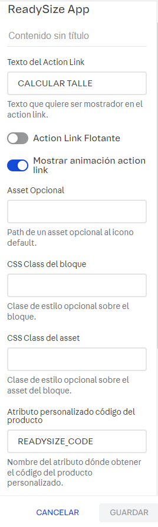

# Documentación de Integración de ReadySize en VTEX IO

Esta documentación describe cómo integrar ReadySize en la plataforma VTEX IO a través de la instalación de la aplicación, la configuración de la dependencia en el `manifest.json` y utilización de los bloques.

## Instalación de la Aplicación ReadySize

Para incorporar la aplicación ReadySize en tu tienda VTEX, sigue los siguientes pasos:

1. Abre un terminal y asegúrate de estar logueado en tu cuenta de VTEX.

2. Ejecuta el siguiente comando para instalar la aplicación ReadySize:

```bash
vtex install fitprendaar.readysize-app@0.0.1
```

3. Una vez instalada la aplicación, agrega las dependencias en el archivo `manifest.json` de tu tienda de la siguiente manera:

```json
"peerDependencies": {
  "fitprendaar.readysize-app": "0.x"
}
```

## Configuración de Bloques ReadySize

Puedes agregar el bloque ReadySize en diferentes ubicaciones de tu tienda. A continuación, se muestra un ejemplo de cómo agregar el bloque en la página de detalles de producto (PDP) dentro del selector de SKU.

```json
"flex-layout.row#sku-selector": {
  "children": [
    "flex-layout.col#sku-selector",
    "flex-layout.col#fitprenda"
  ]
},
"flex-layout.col#sku-selector": {
  "children": ["sku-selector"]
},
"flex-layout.col#fitprenda": {
  "props": {
    "preventVerticalStretch": true,
    "rowGap": 0,
    "width": "30%",
    "blockClass": ["colFitPrenda"]
  },
  "children": ["ReadySize"]
}
```

### Bloque ReadySize

El bloque ReadySize se configura con diferentes propiedades para personalizar su comportamiento. A continuación, se describen las propiedades configurables:

- `buttonText` (string): Permite establecer el texto del enlace (ActionButton), su valor por defecto es "CALCULAR TALLE".

- `themeFloating` (boolean): Permite configurar el botón en una posición flotante en el margen derecho, su valor por defecto es false.

- `showAnimation` (boolean): Habilita o deshabilita la animación del icono predeterminado de ReadySize, , su valor por defecto es true.

- `useStaging` (boolean): Establece si se utilizará el entorno de staging o el entorno productivo, su valor por defecto es true.

- `checkProductStatus` (boolean): Establece si se realizará un chequeo del producto en la plataforma de ReadySize durante la renderización, su valor por defecto es true. Si el producto no existe, no se mostrará el botón de acción.

- `customProductCode` (string): Establece el nombre del atributo personalizado donde se obtiene el valor del código genérico del producto, su valor por defecto es null.

- `customFitTypeCode` (string): Establece el nombre del atributo personalizado donde se obtiene el valor del ajuste de la prenda, su valor por defecto es null.

- `customSizeGuideCode` (string): Establece el nombre del atributo personalizado donde se obtienen las variantes de tallas de la prenda, su valor por defecto es null.

- `assetImage` (string): Permite establecer un icono/imagen personalizada, su valor por defecto es null.

- `classBlockImage` (string): Permite establecer estilos al bloque de la imagen, su valor por defecto es null.

## Ejemplo de Uso

A continuación, se muestra un ejemplo de configuración del bloque ReadySize en el archivo `product.jsonc`:

```json
"ReadySize": {
  "props": {
    "buttonText": "CALCULAR TALLE",
    "themeFloating": false,
    "showAnimation": true,
    "useStaging": true,
    "checkProductStatus": true,
    "customProductCode": "READYSIZE_CODE",
    "customFitTypeCode": "READYSIZE_FITTYPE",
    "customSizeGuideCode": "READYSIZE_SIZEGUIDE_NAME",
    "assetImage": "",
    "classBlockImage": ""
  }
}
```

Estas propiedades también son configurables desde el Site Editor de VTEX. 



## Conclusiones

La integración de ReadySize en tu tienda VTEX permite a tus clientes calcular su talla de manera sencilla y efectiva. Con la instalación de la aplicación y la configuración adecuada de los bloques, puedes personalizar la experiencia del usuario y proporcionar una forma conveniente de seleccionar tallas de productos.

¡Esperamos que esta documentación te sea útil para integrar ReadySize en tu tienda VTEX! Si tienes alguna pregunta adicional o necesitas asistencia, no dudes en contactarnos.
